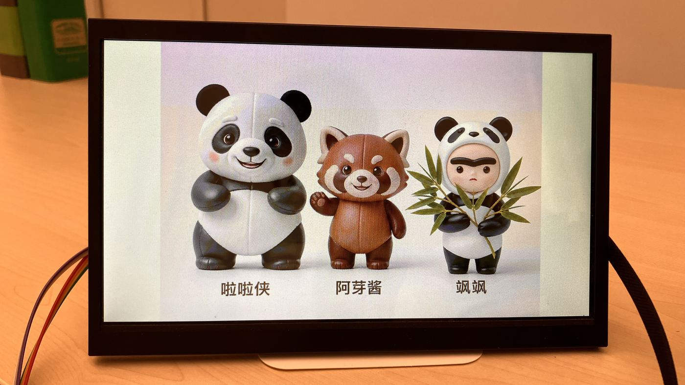

[English](README.md) · [العربية](i18n/README.ar.md) · [Español](i18n/README.es.md) · [Français](i18n/README.fr.md) · [日本語](i18n/README.ja.md) · [한국어](i18n/README.ko.md) · [Tiếng Việt](i18n/README.vi.md) · [中文 (简体)](i18n/README.zh-Hans.md) · [中文（繁體）](i18n/README.zh-Hant.md) · [Deutsch](i18n/README.de.md) · [Русский](i18n/README.ru.md)

[](https://github.com/lachlanchen/lachlanchen/blob/main/figs/banner.png)

# stm32dev

*STM32H7 touch-screen board notes, ST-Link/OpenOCD scripts, and persistent framebuffer patch source.*

[](https://lazying.art)
[](https://www.st.com/)
[](https://openocd.org/)
[](https://github.com/sponsors/lachlanchen)

`stm32dev` is a practical workspace for a connected STM32H74/H75 touch-screen board. It records the wiring, host setup, ST-Link control commands, flash backup/restore workflow, minimal firmware scaffold, and the assembly source for a persistent RGB565 framebuffer hook.

This public repository intentionally excludes generated binaries, flash dumps, local build output, and downloaded tool archives. Those files are hardware-specific and can be recreated or kept locally when needed.

## Display Preview



## Contents

| Path | Purpose |
| --- | --- |
| `scripts/` | Probe, OpenOCD, flash backup/restore, explicit binary flash, and serial-listen helpers. |
| `docs/wiring.md` | SWD, UART, power, and Type-C notes for the board. |
| `config/49-stm32-stlink-local.rules` | Local udev rules for ST-Link permissions and password-prompt avoidance. |
| `firmware/minimal/` | Minimal Cortex-M7 STM32H7 firmware scaffold for toolchain validation. |
| `firmware/persistent_trio/` | Thumb assembly hook and linker scripts used for the persistent display patch. |
| `references/stm32-touch-board-session.md` | Session log with target identification, commands, addresses, cache notes, and restore path. |

## Quick Start

Probe the board:

```sh
./scripts/probe.sh
```

Start OpenOCD:

```sh
./scripts/openocd.sh
```

Back up flash locally:

```sh
./scripts/backup_flash.sh
```

Restore a local firmware backup:

```sh
./scripts/restore_flash.sh backups/stm32h7_current_flash_2026-06-19.bin
```

Build the minimal firmware scaffold:

```sh
make -C firmware/minimal
```

## Persistent Display Patch

The board was identified as an STM32H74/H75 target with a 1024x600 RGB565 LTDC framebuffer at `0xC0000000`. The persistent image experiment stores RGB565 data in unused flash regions and hooks a firmware delay routine so the display framebuffer is restored after boot.

The final working hook:

- returns to `0x08001325`, preserving Thumb mode;
- checks that LTDC layer 1 points at `0xC0000000`;
- invalidates sample D-cache lines before checking SDRAM-visible pixels;
- copies two flash image segments into SDRAM when the framebuffer has been cleared;
- cleans the full framebuffer D-cache range so LTDC can read the CPU-written image.

The detailed addresses and verification hashes are in [`references/stm32-touch-board-session.md`](references/stm32-touch-board-session.md).

## Public Release Notes

The public repo keeps source and documentation only. These local paths are ignored:

- `backups/`
- `build/`
- `**/build/`
- `*.bin`, `*.elf`, `*.map`, `*.o`, `*.d`, `*.log`
- downloaded or extracted xPack tool directories under `tools/`

Do not flash test firmware unless overwriting the currently installed touch-screen firmware is intentional.

## Validation

Commands used during development:

```sh
st-info --probe
openocd -f interface/stlink.cfg -f target/stm32h7x.cfg -c 'adapter speed 1000' -c 'init' -c 'targets' -c 'shutdown'
make -C firmware/minimal
```

## Citation

If you use `stm32dev` in research or documentation, cite this repository. GitHub reads [CITATION.cff](CITATION.cff) and shows a **Cite this repository** panel on the repo page.

```bibtex
@software{chen_stm32dev_2026,
  author = {Chen, Lachlan},
  title = {stm32dev: STM32H7 Touch-Screen Board Development Workspace},
  year = {2026},
  url = {https://github.com/lachlanchen/stm32dev}
}
```

## Status

This is a hardware-session workspace, not a vendor board support package. It is useful as a reproducible record for ST-Link/OpenOCD control, framebuffer experiments, and STM32H7 cache-aware display patching.

## Support

| Donate | PayPal | Stripe |
| --- | --- | --- |
| [](https://chat.lazying.art/donate) | [](https://paypal.me/RongzhouChen) | [](https://buy.stripe.com/aFadR8gIaflgfQV6T4fw400) |
