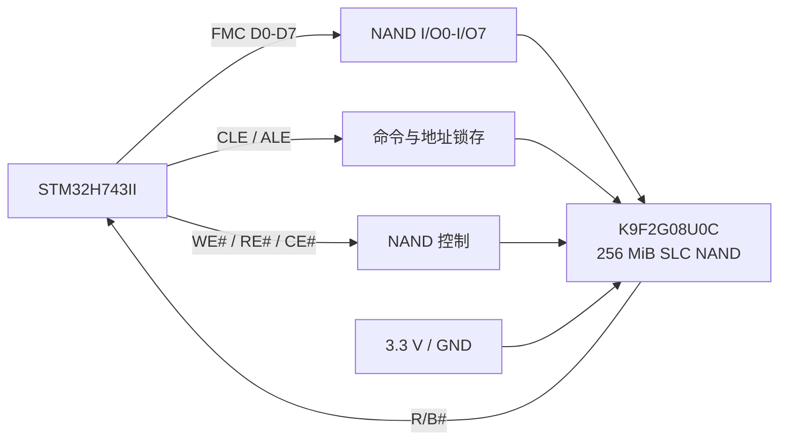
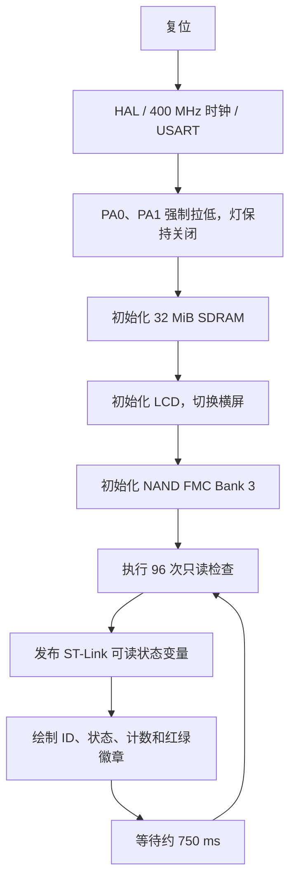

# STM32H743II NAND 诊断、GUI 与存储架构

## 1. 当前验证结论

板载 Samsung `K9F2G08U0C-SIB0` 已通过非破坏性通信检查：

| 项目 | 实测结果 |
| --- | --- |
| 五字节 ID | `EC DA 10 95 44` |
| 状态寄存器 | `0xC0`：Ready=1、Fail=0、WP#=High |
| 合法 ID 命中 | `96/96` |
| 跨时序稳定读取 | `96/96` |
| R/B#、复位状态 | 全部通过，flags=`0x07` |
| 最终结果 | `PASS`，fail mask=`0x00000000` |

之前出现的 `0x20` 是 `FAIL_ID` 位，不是第 20 脚故障。旧诊断只接受资料中的 `EC DA 10 15 44`，而本芯片稳定返回另一种已记录的合法签名 `EC DA 10 95 44`。固件现同时接受两者。

## 2. NAND 如何连接

NAND 焊在核心板上，通过 STM32H743 的 FMC Bank 3 直连，不需要杜邦线。`#` 表示低电平有效。



### 2.1 原理图逐针映射

| STM32 引脚/网络 | NAND TSOP48 引脚 | NAND 信号 | 作用 |
| --- | ---: | --- | --- |
| `PD14 / FMC_D0` | 29 | I/O0 | 8 位复用数据/地址/命令总线 |
| `PD15 / FMC_D1` | 30 | I/O1 | 同上 |
| `PD0 / FMC_D2` | 31 | I/O2 | 同上 |
| `PD1 / FMC_D3` | 32 | I/O3 | 同上 |
| `PE7 / FMC_D4` | 41 | I/O4 | 同上 |
| `PE8 / FMC_D5` | 42 | I/O5 | 同上 |
| `PE9 / FMC_D6` | 43 | I/O6 | 同上 |
| `PE10 / FMC_D7` | 44 | I/O7 | 同上 |
| `PD11 / FMC_CLE` | 16 | CLE | 命令锁存允许 |
| `PD12 / FMC_ALE` | 17 | ALE | 地址锁存允许 |
| `PD5 / FMC_NWE` | 18 | WE# | 写入命令/地址/数据脉冲 |
| `PD4 / FMC_NOE` | 8 | RE# | 读取数据脉冲 |
| `PG9 / FMC_NCE3` | 9 | CE# | 片选 |
| `PD6 / FMC_NWAIT` | 7 | R/B# | Ready/Busy；板上 `10 kOhm` 上拉至 3.3 V |
| 3.3 V | 19 | WP# | 硬件写保护，高电平允许写入 |
| 3.3 V | 12、37 | VCC | NAND 电源，旁路电容去耦 |
| GND | 13、36 | VSS | 地 |

FMC 使用三个地址窗口产生不同锁存信号：

| 地址 | 用途 |
| --- | --- |
| `0x80000000` | 数据区 |
| `0x80010000` | 命令区，CLE 有效 |
| `0x80020000` | 地址区，ALE 有效 |

## 3. 非破坏性焊接诊断

诊断程序只发送三类命令：`RESET (0xFF)`、`READ STATUS (0x70)` 和 `READ ID (0x90)`。程序不包含 Page Program 或 Block Erase，因此不会修改 NAND 内容。

一次循环在三组保守 FMC 时序下各读取 ID 32 次，共 96 次，并检查：

- FMC 是否启用；
- 上电时 R/B# 是否就绪；
- RESET 后是否观察到 Busy 并重新 Ready；
- 状态寄存器的 Ready、Fail 和 WP#；
- ID 是否属于支持的签名；
- 96 次结果是否一致；
- 8 位总线是否呈现明显卡死模式。

错误位定义：

| 位 | 数值 | 含义 |
| ---: | ---: | --- |
| 0 | `0x01` | FMC 初始化失败 |
| 1 | `0x02` | R/B# 空闲状态错误 |
| 2 | `0x04` | RESET 未完成 |
| 3 | `0x08` | 状态寄存器错误 |
| 4 | `0x10` | WP# 状态错误 |
| 5 | `0x20` | ID 不在支持表中 |
| 6 | `0x40` | 多次读取不一致 |
| 7 | `0x80` | 数据总线疑似固定值 |

当前全绿结果强烈说明数据、命令、时序、片选、R/B#、复位、电源和地均已正常连接。但它不是完整存储器老化测试；尚未验证每个块、坏块表、ECC、写入和擦除。

## 4. GUI 是如何实现的

诊断 GUI 是独立固件入口，不会修改或链接正常传感器应用的 `src/main.c`。



关键实现文件：

- `src/nand_diag_main.c`：FMC、诊断状态机、像素绘制和主循环；
- `src/nand_diag_i18n.c/.h`：基于稳定文本 ID 的中英文翻译表；
- `src/nand_diag_cn_font.h`：嵌入固件的 24x24 中文点阵；
- `tools/generate_nand_diag_cn_font.ps1`：从 Microsoft YaHei 生成点阵；
- `tools/set-nand-diag-language.ps1`：通过 ST-Link 在线写语言请求变量；
- `Makefile`：`APP=nand_diag` 选择独立诊断镜像。

界面不依赖脆弱的厂商中文文字函数。ASCII 使用小型点阵，中文使用嵌入点阵，矩形、线条和徽章由 RGB565 像素函数绘制。RGB LCD 的帧缓冲位于外部 SDRAM `0xC0000000`，LTDC 持续扫描该缓冲区到屏幕。默认语言为 `zh-CN`；ST-Link 脚本或已接通的 USART1 均可请求重新绘制英文/中文界面。

## 5. NAND 是什么，能做什么

这颗器件是原始 SLC NAND Flash，不是 RAM，也不是可直接执行代码的普通 ROM：

| 属性 | K9F2G08U0C |
| --- | --- |
| 主数据容量 | `2 Gbit = 256 MiB` |
| OOB/备用区 | `8 MiB`，用于 ECC、坏块标记和元数据 |
| 页大小 | `2048 + 64 bytes` |
| 块大小 | `64 pages = 128 KiB + 4 KiB OOB` |
| 数据保持 | 断电保留 |
| 访问方式 | 先将整页读入内部缓存，再串行读取；不能像 RAM 一样随机读取单字节 |

适合保存：传感器记录、图像/光谱数据、资源文件、模型参数、校准表、日志、备用固件镜像和 OTA 包。

投入实际存储前必须增加 ECC、出厂坏块识别、运行时坏块管理、掉电保护和磨损管理。不能把 FAT 文件系统直接当作无坏块介质使用；需要 NAND 感知驱动、FTL 或适合原始 NAND 的文件系统层。

### 5.1 能否保存 OS 或 ROS

- 可以把 RTOS/应用镜像作为文件保存在 NAND，由内部 Flash 中的一级引导程序校验后复制到 RAM 再启动。
- 不能从这颗原始 NAND 直接 XIP 执行，因为 CPU 看到的是 FMC 命令接口，不是普通线性程序存储器。
- STM32H743 是 Cortex-M7 微控制器，没有运行标准 Linux/桌面 ROS 2 所需的 MMU 和大内存环境。
- 可运行 FreeRTOS、Zephyr、ThreadX、NuttX，以及作为 ROS 2 节点的 micro-ROS。micro-ROS 固件通常放内部 Flash；NAND 更适合数据、模型、日志和升级包。

## 6. 本板 RAM、ROM 与存储结构

厂商规格中的“`2M ROM`”实际主要指可擦写的内部 Flash，并非经典不可改写 ROM。真正的 ROM 是 ST 在芯片中固化的系统 Bootloader。

| 层级 | 容量/地址 | 断电保持 | 当前用途 |
| --- | --- | --- | --- |
| CPU Cache/寄存器 | 芯片内部 | 否 | 最快的即时计算状态 |
| ITCM RAM | 64 KiB，`0x00000000` | 否 | 可放极低延迟指令；当前链接器未使用 |
| DTCM RAM | 128 KiB，`0x20000000` | 否 | 当前保留 32 KiB 栈，适合实时数据 |
| AXI SRAM | 512 KiB，`0x24000000` | 否 | 当前 `.data`、`.bss` 和诊断状态 |
| D2 SRAM1/2/3 | 128+128+32 KiB，`0x30000000` 起 | 否 | DMA/外设缓冲；当前链接器未分配 |
| SRAM4 | 64 KiB，`0x38000000` | 否 | D3 域低功耗/外设缓冲 |
| Backup SRAM | 4 KiB，`0x38800000` | 仅 VBAT 有效 | 小型掉电保持状态 |
| 内部双 Bank Flash | 2 MiB，`0x08000000` | 是 | 启动向量、固件、常量、字体 |
| ST System ROM | 芯片内部保留区 | 永久 | 厂商 Bootloader，用户不能改写 |
| 外部 SDRAM W9825G6KH | 32 MiB，`0xC0000000` | 否 | LCD RGB565 帧缓冲及大数据缓冲 |
| QSPI NOR W25Q64 | 8 MiB，原理图设计 | 是 | 可做资源/XIP/文件存储；当前装配和通信尚未验证 |
| SLC NAND K9F2G08U0C | 256 MiB + OOB，FMC Bank 3 | 是 | 大容量原始存储；当前只读接口检查通过 |
| SD 卡槽 | 容量由卡决定 | 是 | 可移除文件存储；需要 SD/FatFs 驱动 |

当前链接脚本只直接管理内部 Flash、DTCM 和 AXI SRAM。外部 SDRAM由启动代码运行时初始化，NAND 由命令驱动访问，因此它们不会作为普通 C 堆内存自动出现。

## 7. 大致速度层级

| 介质 | 典型特征 | 相对速度 |
| --- | --- | --- |
| ITCM/DTCM/内部 SRAM | CPU 紧耦合或片上总线，纳秒级访问 | 最快，GB/s 量级总线能力 |
| 内部 Flash | 缓存命中时运行代码很快；擦写明显慢于读取 | 快速读、中低速写 |
| 外部 SDRAM | 当前 100 MHz、16 位总线，理论峰值约 200 MB/s | 比片上 RAM 慢，但远快于大容量 Flash |
| QSPI NOR | 支持线性映射和随机读，实际取决于时钟/缓存 | 通常优于随机访问 NAND |
| SLC NAND | 串行周期最小 25 ns，峰值总线约 40 MB/s；整页读取还需最高约 40 us 页装载 | 顺序读取较快，随机小读较慢 |
| SD 卡 | 强依赖卡和总线模式 | 适合文件，不适合确定性实时访问 |

NAND 的理论页编程时间约 250 us/2 KiB，原始上限约 8 MB/s；块擦除约 2 ms/128 KiB。实际速度还会被 ECC、坏块管理、FMC 时序和软件开销降低。因此它属于“容量型非易失存储”，不能替代 RAM。

## 8. 推荐启动与数据架构

```text
STM32 内部 Flash
  -> 启动并初始化时钟、SDRAM、FMC
  -> 读取 NAND 坏块表和带 ECC 的镜像/数据
  -> 校验 CRC/签名
  -> 将需要高速执行或处理的数据复制到内部 RAM/SDRAM
  -> 运行 RTOS、micro-ROS 与传感器应用
```

在实现 NAND 写入前，应先增加“全盘只读页抽样 + ECC/坏块扫描”工具，并继续保留当前完全无写入的焊接诊断镜像作为硬件基准。

## 9. 本地依据

- `D:\BaiduNetdiskDownload\极客STM32H743IIT6核心板资料\原理图\Schematic Prints.pdf`
- `D:\BaiduNetdiskDownload\极客STM32H743IIT6核心板资料\产品规格书\GK-743II.pdf`
- `D:\BaiduNetdiskDownload\极客STM32H743IIT6核心板资料\芯片手册\Samsung-K9F2G08U0C.pdf`
- `D:\BaiduNetdiskDownload\极客STM32H743IIT6核心板资料\芯片手册\ST-STM32H743II.pdf`
- `D:\BaiduNetdiskDownload\极客STM32H743IIT6核心板资料\芯片手册\Winbond-W9825G6KH.pdf`

